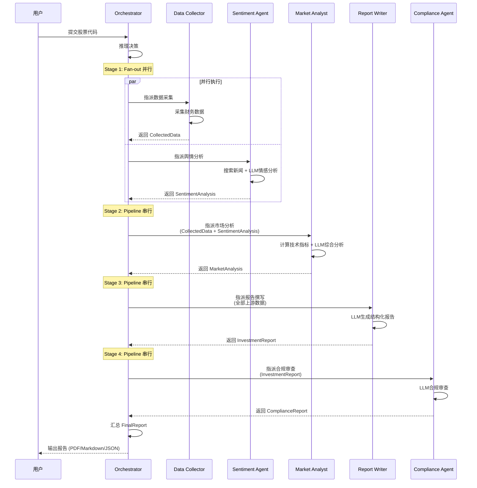
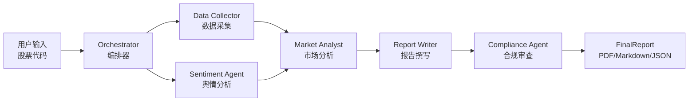

# 基础 Agent：多 Agent 协作的"出厂配置"（v0）

> 这是 Agent 的"出厂设置"，只包含**循环、工具、规划**三件套。没有 Harness 工程加持，它是最朴素的形态。

---

## 1.1 Agent Loop：持续运转的循环

多 Agent 金融研究系统不是"问一句答一句"，而是一个持续运转的循环。与单 Agent 场景不同，这里需要**编排器（Orchestrator）**来调度和协调多个 Agent：



**循环逻辑**：用户提交股票代码 → Orchestrator 调度 → Fan-out 并行执行 Data Collector + Sentiment Agent → Pipeline 串行执行 Market Analyst → Report Writer → Compliance Agent → 汇总输出 FinalReport。

---

## 1.2 基础工具集

5 个 Agent 共享基础工具集：

| 工具 | 用途 | 金融研究场景示例 |
|------|------|-----------------|
| `bash` | 执行 shell 命令 | 检查输出目录是否存在 |
| `read_file` | 读取文件内容 | 读取风格参考文档 |
| `write_file` | 写入文件 | 将报告写入指定路径 |
| `edit_file` | 编辑已有文件 | 修改报告中的某段分析 |
| `web_search` | 联网搜索 | 搜索财经新闻、分析师评级 |

**专用工具（封装在 Agent 内部）**：
- `akshare_tool`：封装 AKShare API，采集 A 股行情、财务指标、公告摘要
- `news_tool`：封装 Tavily API，搜索财经新闻

---

## 1.3 数据模型：Pydantic v2 强制 JSON Schema

Agent 之间的数据传递通过 Pydantic 模型约束，确保数据一致性：

```python
class StockQuery(BaseModel):
    """用户输入"""
    ticker: str          # 股票代码，如 "600519"
    period: str = "1y"   # 分析周期
    language: str = "zh" # 报告语言

class CollectedData(BaseModel):
    """Data Collector 的输出"""
    ticker: str
    company_info: CompanyInfo
    financial_metrics: FinancialMetrics
    recent_prices: list[StockPrice]
    disclosures: list[str]
    data_sources: list[str]

class SentimentAnalysis(BaseModel):
    """Sentiment Agent 的输出"""
    ticker: str
    overall_sentiment: SentimentScore
    sentiment_score: float
    news_items: list[NewsItem]
    key_topics: list[str]

class MarketAnalysis(BaseModel):
    """Market Analyst 的输出"""
    ticker: str
    trend_direction: str
    technical_indicators: list[TechnicalIndicator]
    risk_factors: list[RiskFactor]
    recommendation: Recommendation

class InvestmentReport(BaseModel):
    """Report Writer 的输出"""
    title: str
    ticker: str
    executive_summary: str
    company_overview: str
    # ... 7 个章节

class ComplianceReport(BaseModel):
    """Compliance Agent 的输出"""
    is_compliant: bool
    issues: list[ComplianceIssue]
    compliance_score: float
```

---

## 1.4 规划能力：Pipeline + Fan-out 编排

金融研究是典型的**多步骤、多 Agent 协作任务**。Orchestrator 通过 `asyncio.gather()` 实现 Fan-out 并行：

```python
# Stage 1: Fan-out 并行
async def generate_report(self, query: StockQuery) -> FinalReport:
    collected_data, sentiment = await asyncio.gather(
        self.data_collector.execute(query),   # Agent 1
        self.sentiment_agent.execute(query),    # Agent 2
    )

    # Stage 2: Pipeline 串行（依赖 Stage 1 输出）
    market_analysis = await self.market_analyst.execute(
        collected_data, sentiment
    )

    # Stage 3: Pipeline 串行
    report = await self.report_writer.execute(
        collected_data, sentiment, market_analysis
    )

    # Stage 4: Pipeline 串行
    compliance = await self.compliance_agent.execute(
        report, collected_data
    )

    return FinalReport(
        report=report,
        compliance=compliance,
        # ...
    )
```

---

## 1.5 出厂配置描述（v0）

> 以下描述可作为 UI 面向用户的配置面板呈现，也可作为面向 Coding Agent 的提示词。

---

**【金融研究多 Agent 系统 v0 — 出厂配置】**

**身份**：你是一个多 Agent 金融研究报告自动生成系统，包含 5 个协作 Agent，根据用户输入的股票代码自动生成投资研究报告。

**Agent 角色**：
- **Data Collector**：从 AKShare 采集 A 股行情、财务指标、公告摘要
- **Sentiment Agent**：从 Tavily 搜索财经新闻，使用 LLM 分析情感倾向
- **Market Analyst**：计算技术指标（RSI、MA、波动率），使用 LLM 综合分析市场趋势
- **Report Writer**：综合所有分析结果，生成包含 7 个章节的结构化投资报告
- **Compliance Agent**：审查报告合规性，检查免责声明、数据引用、监管合规

**工具**（所有 Agent 共享）：
- `bash`：执行 shell 命令
- `read_file`：读取文件内容
- `write_file`：写入文件
- `edit_file`：编辑文件
- `web_search`：联网搜索

**专用工具**（封装在 Agent 内部）：
- `akshare_tool`：AKShare API 封装
- `news_tool`：Tavily API 封装

**编排模式**：Pipeline + Fan-out 并行
1. Stage 1（Fan-out）：Data Collector + Sentiment Agent 并行执行
2. Stage 2（Pipeline）：Market Analyst 等待 Stage 1 完成后综合分析
3. Stage 3（Pipeline）：Report Writer 生成结构化报告
4. Stage 4（Pipeline）：Compliance Agent 审查合规性

**循环**：Orchestrator 调度 → Agent 执行 → 返回结果 → 直到所有 Stage 完成。

---

## 1.6 v0 的架构示意


