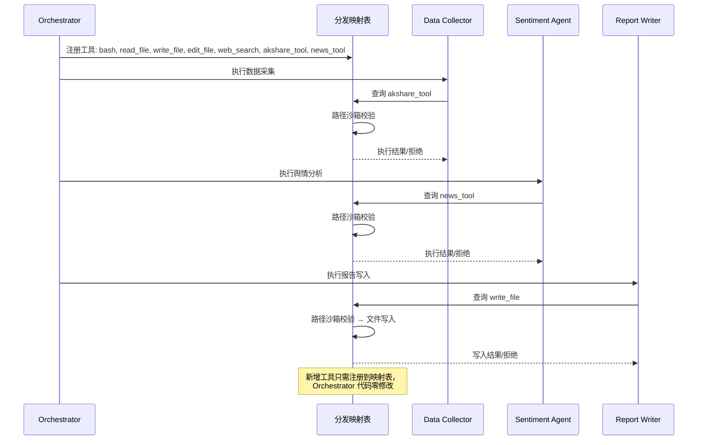

# Harness 迭代 1：工具分发与安全沙箱（v1）

## 2.1 可优化点

v0 中工具调用是"裸执行"的——尤其是 `bash`，Agent 可以执行任何 shell 命令，包括 `rm -rf /`。`read_file`、`write_file` 虽然天然比 `bash cat` 更安全，但 v0 没有路径沙箱，Agent 可能读取或写入工作区外的敏感文件。

在金融研究场景中，这个问题更加严重：
- **Data Collector** 可能通过 `bash` 执行恶意命令，把采集到的敏感财务数据发送到外部服务器
- **Report Writer** 可能通过 `write_file` 写入工作区外的系统目录
- 工具调用的分发逻辑如果硬编码在 Orchestrator 里，每增加一个工具（如新增金融数据 API）就要修改编排代码

## 2.2 Harness 策略

| 策略 | 说明 |
|------|------|
| **工具分发映射** | 将工具名与处理函数的映射抽成独立字典（Dispatch Map），新增工具只需注册，不改 Orchestrator |
| **路径沙箱** | 对 `read_file`、`write_file`、`edit_file` 做路径校验，确保只能访问工作区内的文件 |

## 2.3 迭代后的描述（v1）

**【金融研究多 Agent 系统 v1 — 工具分发与沙箱】**

**（在 v0 基础上新增/变更）**

**工具分发**：所有工具通过分发映射表注册。新增工具只需在映射表中添加一条，Orchestrator 不做任何修改。5 个 Agent 共享同一套 Dispatch Map，每个 Agent 可以按需注册自己的工具子集：
- Data Collector：额外注册 `akshare_tool`、`news_tool`
- Sentiment Agent：额外注册 `tavily_search`
- Market Analyst：额外注册 `technical_indicator_calculator`

**路径沙箱**：
- `read_file`、`write_file`、`edit_file` 在执行前做路径安全校验
- 只允许访问用户指定的输出目录及其子路径
- 路径逃逸（如 `../../etc/passwd`）直接拒绝并返回错误信息
- `bash` 暂无沙箱约束（将在下一轮迭代解决）

**错误反馈**：路径校验失败时，返回清晰错误信息而非沉默失败，让 Agent 理解"为什么被拒绝"并调整行为。

---

## 2.4 架构变化示意

