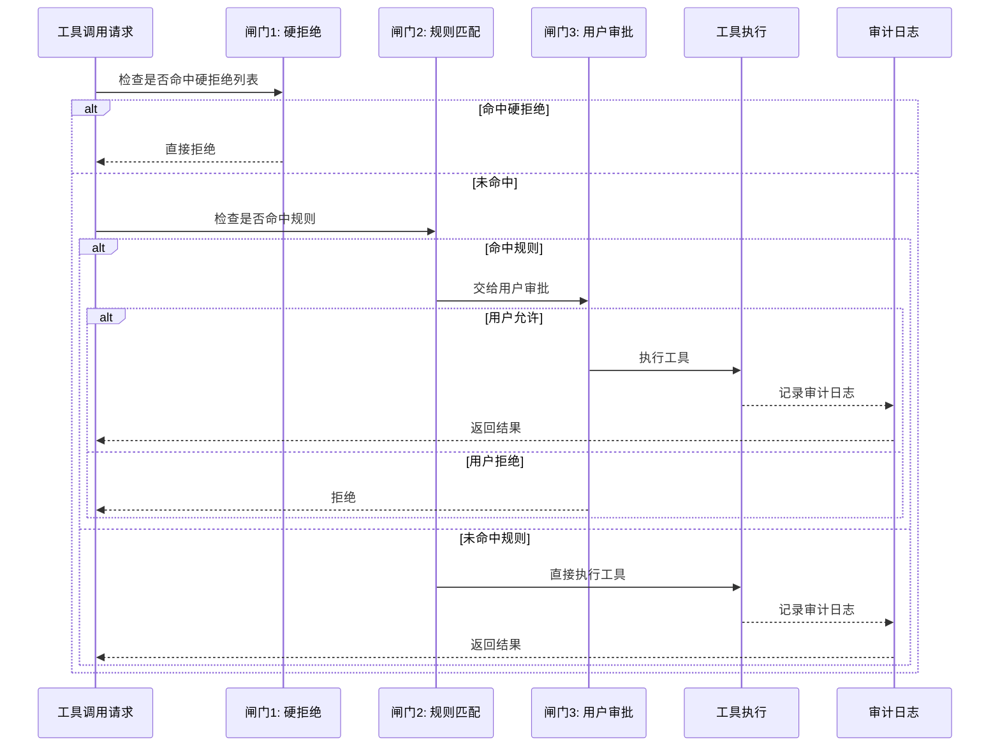

# Harness 迭代 2：权限管线（v2）

## 3.1 可优化点

v1 对文件工具做了沙箱，但 `bash` 仍然不受约束。让 Data Collector "清理一下临时文件"，可能执行 `rm -rf /`。安全不能靠信任模型——模型不会主动"作恶"，但可能执行不恰当的命令。

在金融研究场景中，权限问题更加敏感：
- **金融数据泄露风险**：Data Collector 可能通过 `bash curl` 将采集到的敏感财务数据外发到不可信服务器
- **分级权限需求**：普通研究员只能读取公开数据，高级分析师可以访问内部数据库，合规审核员可以审计所有操作
- **数据越界访问**：一个研究团队的数据不应被另一个团队看到

此外，文件沙箱只做了"全拒绝"，没有"需要用户确认"的中间地带。比如写入输出目录外的文件，可能是有意为之（用户要求存到特定位置），应该让用户决定。

## 3.2 Harness 策略

| 策略 | 说明 |
|------|------|
| **三道闸门权限管线** | 工具执行前依次经过：硬拒绝 → 规则匹配 → 用户审批，通过后才执行 |
| **硬拒绝列表** | 永远禁止的危险操作（`rm -rf /`、`sudo`、`mkfs` 等），命中即拒 |
| **规则匹配** | 上下文相关的操作（写工作区外、`rm` 文件等），触发后交给用户审批 |
| **用户审批** | 规则命中后暂停等用户确认，用户决定允许或拒绝 |

## 3.3 迭代后的描述（v2）

**【金融研究多 Agent 系统 v2 — 权限管线】**

**（在 v1 基础上新增/变更）**

**权限管线**：每个工具调用执行前，依次经过三道闸门：

| 闸门 | 作用 | 命中后行为 |
|------|------|-----------|
| 1. 硬拒绝列表 | 永远禁止的危险操作 | 直接拒绝，不执行 |
| 2. 规则匹配 | 取决于上下文的操作 | 交给闸门 3 |
| 3. 用户审批 | 规则命中后暂停等确认 | 用户决定允许或拒绝 |

三道都没命中 → 直接执行。大部分日常操作（读参考文档、搜索素材、写入输出目录）走这条路径，无需用户干预。

**金融研究场景的典型规则**：
- `bash` 中包含 `rm`、`sudo`、`curl` 向外部发送数据等关键词 → 触发闸门 2 → 用户审批
- `write_file` 写入输出目录外 → 触发闸门 2 → 用户审批
- `read_file` 读取非工作区文件 → 触发闸门 2 → 用户审批
- `web_search` 搜索涉及内幕信息的敏感查询 → 触发闸门 2 → 记录审计日志

**循环变更**：v1 的循环在工具执行前新增一行权限检查。检查不通过则返回 `Permission denied` 作为工具结果，让 Agent 知道被拒绝的原因。

---

## 3.4 权限管线流程

