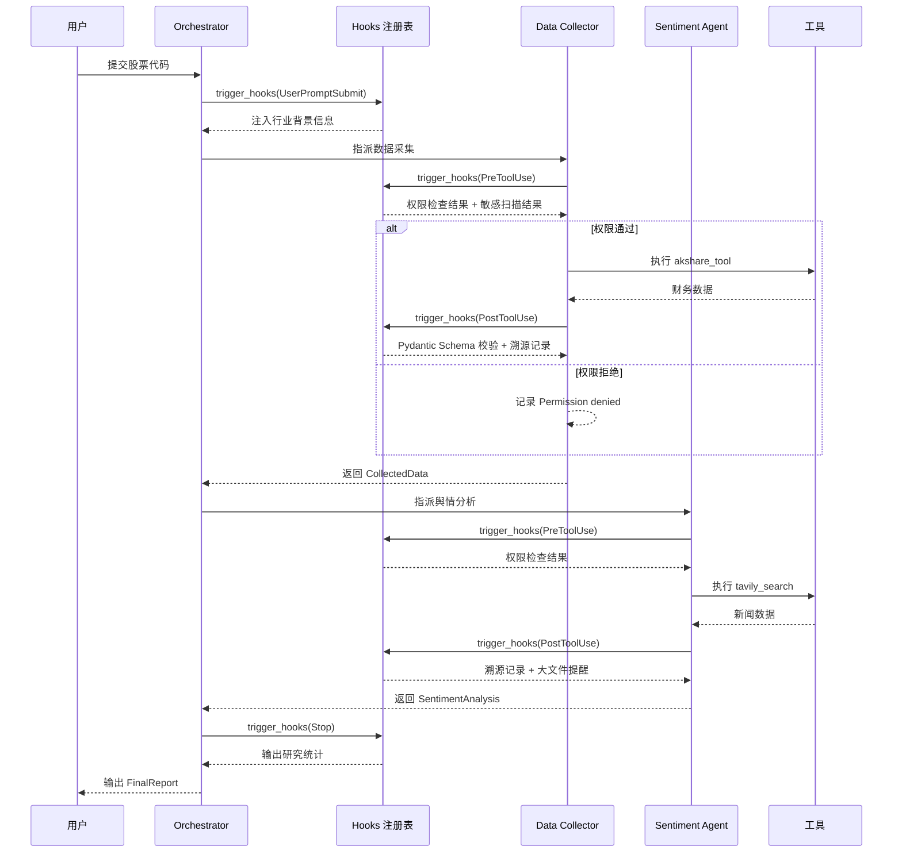

# Harness 迭代 3：Hooks 扩展机制（v3）

## 4.1 可优化点

v2 把权限检查 `check_permission()` 硬编码在循环体里。如果未来还想加"每次工具调用后自动记录日志"、"写入文件后自动做格式校验"、"每次搜索后记录搜索词用于素材溯源"——每次扩展都要改循环代码。循环很快就会膨胀到不可维护。

在金融研究场景中，Hook 的需求更加强烈：
- **数据采集后自动校验**：Data Collector 获取财报数据后，需要自动校验数据格式是否符合 Pydantic Schema
- **报告写入后自动备份**：InvestmentReport 生成后，需要自动备份到版本控制系统
- **搜索关键词溯源**：每次 `web_search` / `tavily_search` 执行后，需要记录搜索关键词和结果摘要，用于后续审计
- **敏感数据扫描**：任何写入操作前，需要扫描内容是否包含敏感信息（如未公开的并购信息）

循环应该是稳定的核心，扩展逻辑应该挂在外面。

## 4.2 Harness 策略

| 策略 | 说明 |
|------|------|
| **Hooks 注册表** | 把扩展逻辑从循环体移到钩子回调，循环只调用 `trigger_hooks()` |
| **四个 Hook 事件** | 覆盖一个完整的 Agent Cycle：输入提交前、工具执行前、工具执行后、循环退出前 |
| **权限检查迁移** | v2 的 `check_permission()` 从循环移到 `PreToolUse` hook |

**四个事件**：

| 事件 | 触发时机 | 金融研究场景用途 |
|------|---------|---------------|
| `UserPromptSubmit` | 用户输入提交后、进入 LLM 前 | 注入当前股票代码的行业背景信息 |
| `PreToolUse` | 工具执行前 | 权限检查、敏感数据扫描 |
| `PostToolUse` | 工具执行后 | 数据校验、素材溯源记录、自动备份 |
| `Stop` | 循环即将退出时 | 输出研究统计（搜索次数、数据源数量、总耗时） |

## 4.3 迭代后的描述（v3）

**【金融研究多 Agent 系统 v3 — Hooks 扩展机制】**

**（在 v2 基础上新增/变更）**

**Hooks 机制**：循环中不再直接调用权限检查函数，改为调用 `trigger_hooks(事件名, 参数)`，由注册表决定执行哪些回调。

**已注册的 Hooks**：

| 事件 | 回调 | 作用 |
|------|------|------|
| `UserPromptSubmit` | `context_inject_hook` | 注入当前股票代码的行业背景信息 |
| `PreToolUse` | `permission_hook` | 三道闸门权限检查（v2 的逻辑，从循环移到 hook） |
| `PreToolUse` | `sensitive_scan_hook` | 扫描工具输入是否包含敏感关键词 |
| `PreToolUse` | `log_hook` | 记录每次工具调用日志 |
| `PostToolUse` | `data_validation_hook` | `akshare_tool` / `news_tool` 执行后校验返回数据是否符合 Pydantic Schema |
| `PostToolUse` | `source_trace_hook` | `tavily_search` 执行后记录搜索词和结果摘要，用于素材溯源 |
| `PostToolUse` | `auto_backup_hook` | `write_file` 执行后自动备份报告到版本控制 |
| `PostToolUse` | `large_output_hook` | 工具返回内容过大时提醒 |
| `Stop` | `research_summary_hook` | 输出研究统计（工具调用次数、数据源数量、总耗时） |

**循环变更**：v2 的 `check_permission(block)` 替换为 `trigger_hooks("PreToolUse", block)`；工具执行后新增 `trigger_hooks("PostToolUse", block, output)`；退出前新增 `trigger_hooks("Stop", messages)`（可阻止退出实现强制续跑）。

**扩展方式**：未来任何新扩展（如接入新的金融数据 API）只需 `register_hook("PostToolUse", callback)` 即可，循环代码零修改。

---

## 4.4 Hooks 在 Agent Cycle 中的位置

