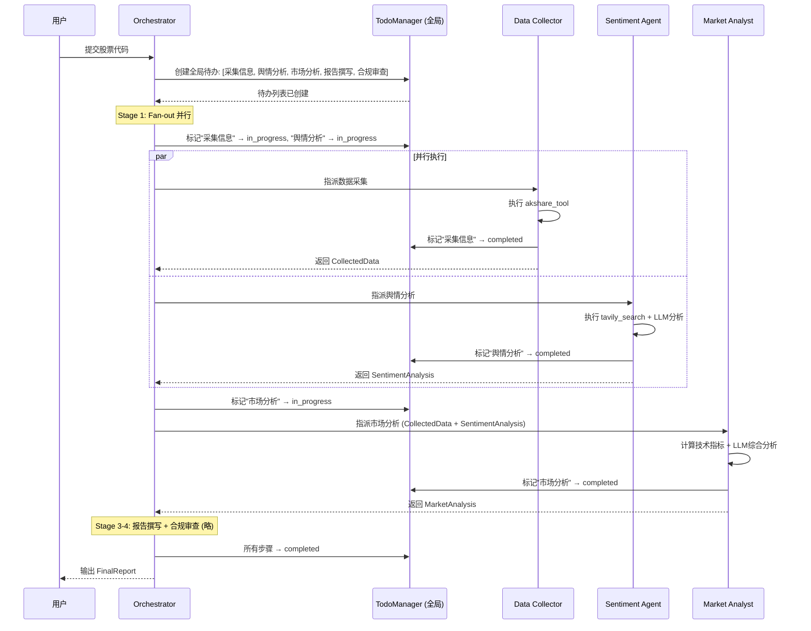

# Harness 迭代 4：规划与待办管理（v4）

## 5.1 可优化点

v0 虽然提到了任务分解，但只是简单描述。实际上，金融研究是一个典型的多步骤、多 Agent 协作任务——数据采集、舆情分析、市场分析、报告撰写、合规审查——步骤之间有依赖，且容易跑偏：

- **多 Agent 场景下的状态同步问题**：Data Collector 完成了"茅台财报"的采集，但 Market Analyst 不知道，还在等待
- **任务依赖管理缺失**：Market Analyst 必须等 Data Collector 和 Sentiment Agent 都完成后才能开始，但系统没有显式表达这种依赖
- **Agent 注意力漂移**：Data Collector 采集了 20 份财报后，忘了最初的研究主题是什么
- **任务进度不透明**：用户不知道研究进行到哪一步了，是正在采集数据还是正在撰写报告

**没有规划的 Agent 走哪算哪。在多 Agent 场景下，这个问题会被放大——一个 Agent 的跑偏会拖累整个系统。**

## 5.2 Harness 策略

| 策略 | 说明 |
|------|------|
| **TodoManager 状态管理** | 待办项有三种状态：`pending`、`in_progress`、`completed`；同一时间只允许一个 `in_progress`，强制顺序聚焦 |
| **Nag Reminder** | Agent 连续 3 轮以上不更新待办时，系统自动注入提醒 `<reminder>Update your todos.</reminder>`，制造问责压力 |
| **跨 Agent 待办同步** | Orchestrator 维护全局待办列表，子 Agent 通过 Hook 机制同步自己的进度 |
| **金融研究规划模板** | 为金融研究任务提供默认的待办结构，避免 Agent 从零规划 |

## 5.3 迭代后的描述（v4）

**【金融研究多 Agent 系统 v4 — 规划与待办管理】**

**（在 v3 基础上新增/变更）**

**TodoManager**：
- 待办项有 `pending`、`in_progress`、`completed` 三种状态
- 同一时间只允许一个 `in_progress`（强制聚焦，防止多 Agent 同时争抢同一任务）
- `todo_write` 工具作为分发映射表中的又一工具，与其他工具平级
- **新增：跨 Agent 状态同步**——每个 Agent 完成自己的子任务后，通过 `todo_write` 更新全局状态

**Nag Reminder**：Agent 连续 3 轮未调用 `todo_write` 时，系统在最近一条工具结果前注入提醒，强制 Agent 回顾计划。

**金融研究默认规划模板**（Orchestrator 收到任务后可参考此模板生成待办）：

| 序号 | 步骤 | 负责 Agent | 依赖 | 说明 |
|------|------|-----------|------|------|
| 1 | 采集公司信息 | Data Collector | — | 从 AKShare 获取公司基本信息 |
| 2 | 采集财务指标 | Data Collector | — | 获取营收、利润、PE/PB 等核心指标 |
| 3 | 采集股价历史 | Data Collector | — | 获取最近 N 个交易日的价格数据 |
| 4 | 采集公告摘要 | Data Collector | — | 获取最近公告和监管披露 |
| 5 | 搜索财经新闻 | Sentiment Agent | — | 从 Tavily 搜索相关新闻 |
| 6 | 舆情情感分析 | Sentiment Agent | 步骤 5 | LLM 分析新闻情感倾向 |
| 7 | 计算技术指标 | Market Analyst | 步骤 3 | RSI、MA、波动率等纯数学计算 |
| 8 | 综合市场分析 | Market Analyst | 步骤 2, 6, 7 | LLM 综合分析，给出投资建议 |
| 9 | 撰写报告 | Report Writer | 步骤 1-8 | 生成 7 章节的结构化报告 |
| 10 | 合规审查 | Compliance Agent | 步骤 9 | 检查免责声明、数据引用、监管合规 |

**跨 Agent 同步机制**：
- Orchestrator 维护全局待办列表（Master Todo）
- 子 Agent 执行完自己的任务后，调用 `todo_write` 更新全局状态
- Orchestrator 通过 `PostToolUse` Hook 监听子 Agent 的进度更新

**循环变更**：新增 `rounds_since_todo` 计数器，每轮工具执行后递增，调用 `todo_write` 时重置为 0。多 Agent 场景下，每个 Agent 独立计数。

---

## 5.4 待办管理在多 Agent 流程中的时序

