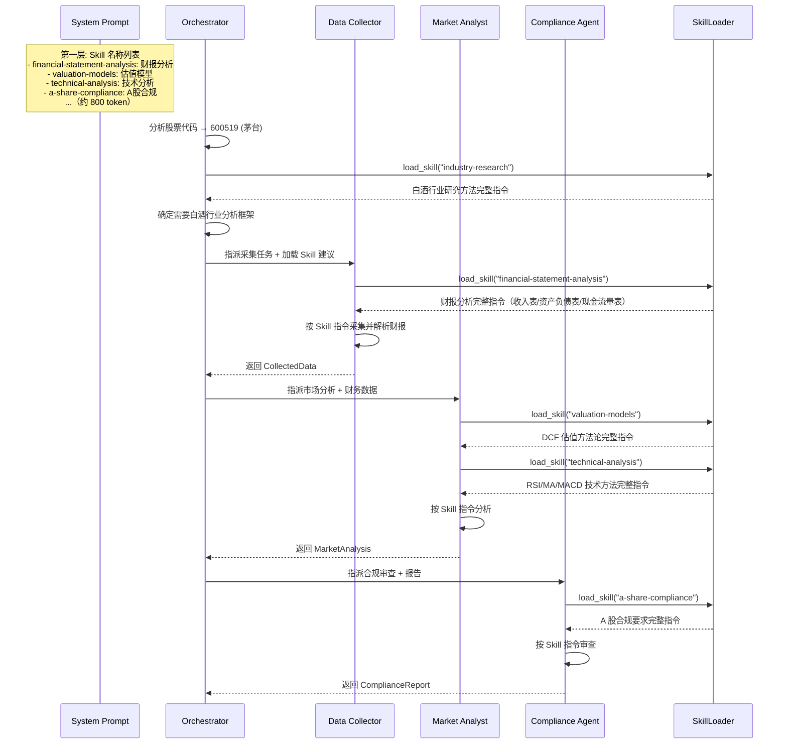

# Harness 迭代 5：Skill 按需知识加载（v5）

## 6.1 可优化点

金融研究 Agent 需要多种领域知识：财报结构解析、行业术语解释、估值模型方法、不同行业的分析框架、A 股监管合规要求……全塞进 System Prompt 太浪费——10 个 Skill 每个 2000 token 就是 20000 token，大部分跟当前研究任务毫无关系。

在金融研究场景中，这个问题更加突出：
- **行业知识差异大**：分析茅台（白酒行业）和分析宁德时代（新能源行业）需要的专业知识完全不同
- **分析框架多样**：DCF 估值、PE 估值、EV/EBITDA 等不同估值模型适用于不同场景
- **合规要求不同**：不同行业的研究报告有不同的合规披露要求
- **报告模板各异**：卖方研报、买方研报、内部备忘录的格式和深度要求不同

如果把这些知识全塞进 System Prompt，不仅浪费 token，还会干扰 Agent 的注意力——irrelevant 的行业知识会让 Agent 在分析时产生混淆。

## 6.2 Harness 策略

| 策略 | 说明 |
|------|------|
| **两层知识注入** | 第一层：System Prompt 中只放 Skill 名称和简短描述（低成本）；第二层：Agent 按需调用 `load_skill` 加载完整内容 |
| **Skill 文件组织** | 每个 Skill 是一个目录，包含 `SKILL.md` 文件（YAML frontmatter + 完整指令） |
| **金融研究专用 Skill 库** | 预置金融研究领域的常用 Skill |

## 6.3 迭代后的描述（v5）

**【金融研究多 Agent 系统 v5 — Skill 按需加载】**

**（在 v4 基础上新增/变更）**

**工具新增**：`load_skill`——按名称加载某个 Skill 的完整指令内容。

**Skill 库（预置）**：

| Skill 名称 | 描述 | 典型场景 |
|------------|------|---------|
| `financial-statement-analysis` | 财报结构与关键指标分析：收入表、资产负债表、现金流量表 | Data Collector 解析财报 |
| `valuation-models` | 估值模型：DCF、PE、EV/EBITDA、DDM 等方法论 | Market Analyst 估值分析 |
| `industry-research` | 行业研究方法：产业链分析、竞争格局、市场规模 | Market Analyst 行业深度研究 |
| `research-report-writing` | 研究报告写作规范：结构、措辞、合规要求 | Report Writer 撰写卖方/买方研报 |
| `macro-economics` | 宏观经济分析：GDP、通胀、利率、政策影响 | Market Analyst 宏观环境分析 |
| `risk-assessment` | 风险评估框架：财务风险、经营风险、市场风险 | Market Analyst 风险提示章节 |
| `a-share-compliance` | A 股合规要求：免责声明、数据引用、监管合规 | Compliance Agent 合规审查 |
| `technical-analysis` | 技术分析方法：RSI、MA、MACD、KDJ 等 | Market Analyst 计算技术指标 |

**两层注入**：
- **第一层（常驻）**：System Prompt 中列出所有可用 Skill 的名称和一句话描述，约 100 token/Skill
- **第二层（按需）**：Agent 判断当前任务需要某个 Skill 时，调用 `load_skill("financial-statement-analysis")`，完整指令作为 `tool_result` 注入，约 2000 token

**金融研究流程集成**：
1. Orchestrator 收到研究任务后，先分析股票代码所属行业
2. 根据行业判断需要加载哪些 Skill（如茅台 → 白酒行业 + DCF 估值）
3. Data Collector 加载 `financial-statement-analysis` Skill，按规范解析财报
4. Market Analyst 加载 `valuation-models` 和 `technical-analysis` Skill，选择合适的估值方法
5. Report Writer 加载 `research-report-writing` Skill，按模板组织报告
6. Compliance Agent 加载 `a-share-compliance` Skill，按 A 股合规要求审查

---

## 6.4 Skill 加载时序

