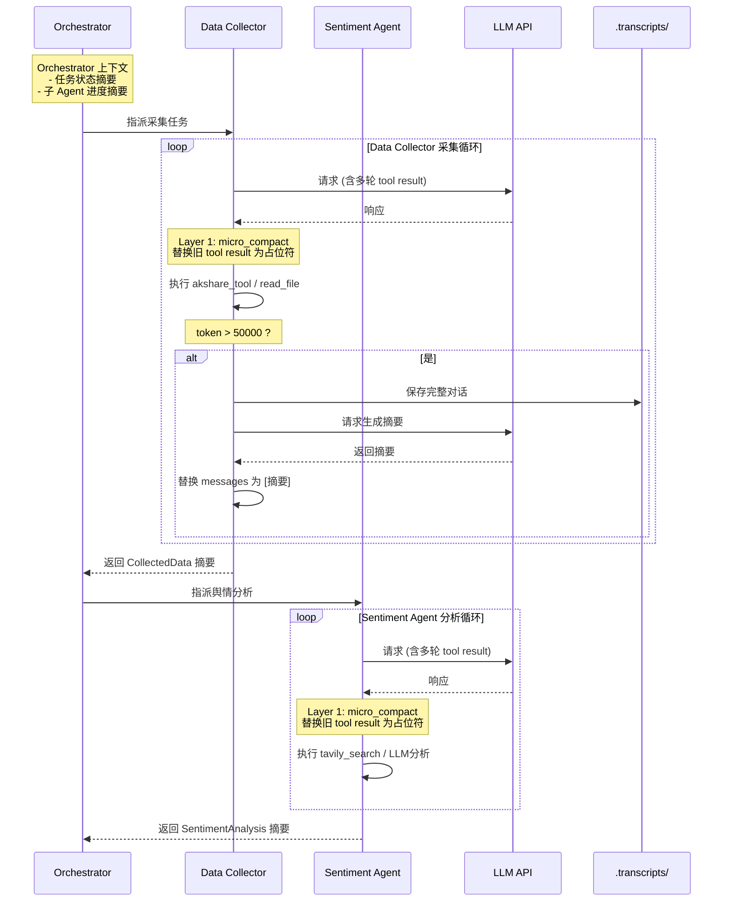

# Harness 迭代 6：上下文压缩（v6）

## 7.1 可优化点

上下文窗口是有限的。Data Collector 读取一份 1000 行的财报就吃掉 ~4000 token；采集 10 份财报、搜索 20 条新闻、执行 30 次工具调用，轻松突破 100k token。

在金融研究场景中，这个问题更加严重：
- **Data Collector 读了 20 份财报后上下文溢出**：Agent 忘了最初的研究主题，开始重复采集
- **Market Analyst 被大量原始数据淹没**：上下文里塞满了财报原文和新闻全文，挤占了分析推理的空间
- **多 Agent 协作时的上下文冗余**：Orchestrator 的上下文里同时保留了多个 Agent 的详细执行记录，信息噪音大
- **Report Writer 生成超长报告时截断**：一份完整的研报可能超过 8000 token，导致输出被截断

**不压缩，Agent 根本没法处理大规模金融数据。**

## 7.2 Harness 策略

| 策略 | 说明 |
|------|------|
| **三层压缩策略** | 激进程度递增：micro compact → auto compact → manual compact |
| **Micro Compact** | 静默替换：将旧的 tool result 替换为占位符（如"[Previous: used akshare_tool]"） |
| **Auto Compact** | 阈值触发：token 超过阈值时，保存完整对话到磁盘，LLM 生成摘要后替换 |
| **Manual Compact** | 按需触发：Agent 显式调用 `compact` 工具触发同样的摘要机制 |

## 7.3 迭代后的描述（v6）

**【金融研究多 Agent 系统 v6 — 上下文压缩】**

**（在 v5 基础上新增/变更）**

**三层压缩策略**：

| 层级 | 触发条件 | 行为 | 金融研究场景示例 |
|------|---------|------|---------------|
| Layer 1: micro_compact | 每轮自动执行 | 替换超过 3 轮的 tool result 为占位符 | "[Previous: 已采集茅台 Q2 财报]" |
| Layer 2: auto_compact | token > 50000 | 保存完整对话到 .transcripts/，LLM 生成摘要后替换 | 采集了 10 份财报后自动触发 |
| Layer 3: manual_compact | Agent 显式调用 `compact` | 同上，但由 Agent 主动触发 | 信息采集完成后，Agent 主动压缩上下文 |

**多 Agent 场景的压缩策略**：
- **Data Collector 的上下文**：以原始数据为主，micro compact 频繁触发，保留最近 3 轮的工具结果
- **Sentiment Agent 的上下文**：以新闻原文和情感分析为主，auto compact 在新闻数量过多时触发
- **Market Analyst 的上下文**：以分析结论为主，保留关键技术指标和分析摘要
- **Report Writer 的上下文**：以报告草稿为主，auto compact 在报告过长时触发
- **Orchestrator 的上下文**：以任务调度和协调决策为主，保留全局状态摘要而非详细执行记录

**完整历史保留**：所有完整对话通过 transcript 保存在磁盘上。信息没有真正丢失，只是移出了活跃上下文。需要时可以回溯查看。

---

## 7.4 上下文压缩在多 Agent 流程中的位置

