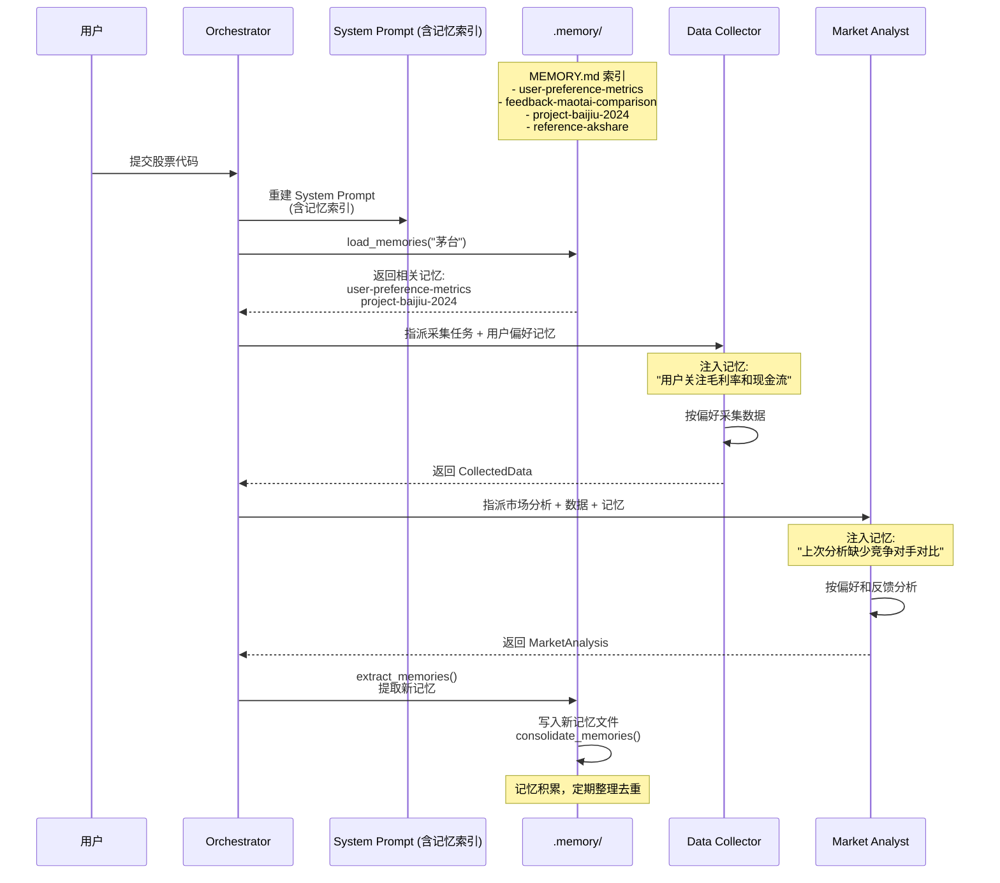

# Harness 迭代 7：记忆系统（v7）

## 8.1 可优化点

v6 的 auto_compact 会把当前目标、剩余工作、用户约束写进摘要，但**细节会丢失**："用户关注毛利率变化而非收入增长"可能被简化成"用户有关键指标偏好"。而且**新开一个会话，连摘要也没了**。

在金融研究场景中，记忆丢失的问题更加严重：
- **用户偏好丢失**：用户上次说"我关注毛利率和现金流，不要给我看收入增长"，下次会话 Agent 忘了，又按默认模板生成报告
- **研究历史丢失**：用户上周研究了茅台，本周继续研究时 Agent 不记得之前的研究结论
- **风格偏好丢失**：用户习惯看特定格式的数据表格，每次都要重新说明
- **机构合规要求丢失**：不同机构对研究报告的合规披露要求不同，需要跨会话保留

LLM 没有持久状态，所有信息都在上下文窗口里。上下文满了要压缩，压缩就有损。需要一层不参与压缩、跨会话保留的存储。

## 8.2 Harness 策略

| 策略 | 说明 |
|------|------|
| **文件仓库 + 索引** | `.memory/` 目录下，每个记忆一个 `.md` 文件，带 YAML frontmatter；`MEMORY.md` 作为索引 |
| **两条加载路径** | 路径一：索引常驻 SYSTEM prompt（可被 prompt cache 缓存）；路径二：相关记忆按需注入（按 filename/description 匹配） |
| **自动提取** | 每轮结束后后台提取新记忆（用户偏好、研究结论、风格偏好等） |
| **定期整理** | 记忆文件积累到一定数量后，LLM 去重、合并矛盾、淘汰过时记忆 |

## 8.3 迭代后的描述（v7）

**【金融研究多 Agent 系统 v7 — 记忆系统】**

**（在 v6 基础上新增/变更）**

**四类记忆**：

| 类型 | 回答什么 | 金融研究场景示例 |
|------|---------|---------------|
| `user` | 用户偏好 | "关注毛利率和现金流，不要看收入增长" |
| `feedback` | 研究反馈 | "上次茅台分析缺少竞争对手对比" |
| `project` | 研究背景 | "当前研究覆盖 2024 Q1-Q2 的白酒行业" |
| `reference` | 数据源 | "茅台财报数据源：AKShare" |

**加载路径一：索引常驻 SYSTEM**

`build_system()` 每轮重建 SYSTEM 时读取 `MEMORY.md`，把记忆清单注入。SYSTEM prompt 中的索引可以被 prompt cache 缓存。

```markdown
# MEMORY.md
- [user-preference-metrics](user-preference-metrics.md) — 用户关注毛利率和现金流
- [feedback-maotai-comparison](feedback-maotai-comparison.md) — 上次分析缺少竞争对手对比
- [project-baijiu-2024](project-baijiu-2024.md) — 2024 年白酒行业研究项目
- [reference-akshare](reference-akshare.md) — AKShare 财报数据源
```

**加载路径二：相关记忆按需注入**

每轮调用前，`load_memories()` 把最近对话和记忆目录（name + description）一起发给 LLM 做一次轻量 side-query，选出相关的文件名，再读文件内容注入上下文。最多 5 条，控制开销。

**写入：每轮结束后提取**

`extract_memories()` 在每轮结束时运行，条件是模型停止且没有 tool_use（说明对话告一段落）。提取 prompt 要求 LLM 返回 `{name, type, description, body}` 的 JSON 数组。

---

## 8.4 记忆系统在多 Agent 流程中的位置


