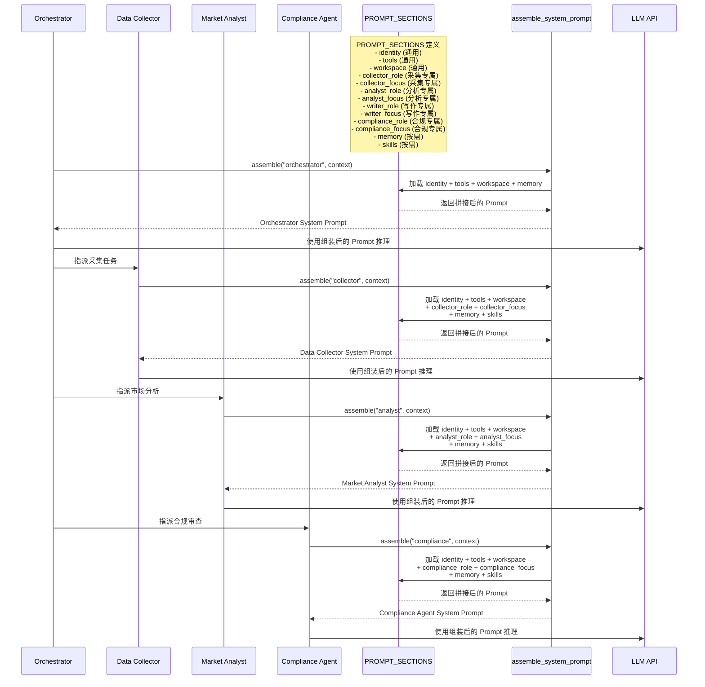

# Harness 迭代 8：System Prompt 运行时组装（v8）

## 9.1 可优化点

从 v0 到 v7，System Prompt 都是一行硬编码：

```python
SYSTEM = "你是一个多 Agent 金融研究报告自动生成系统的 Orchestrator..."
```

v7 够用，只有基础工具定义。但到 v7，Agent 已经有记忆、有压缩、有技能加载、有权限管线。System Prompt 该提的能力越来越多：

```python
SYSTEM = (
    "你是一个多 Agent 金融研究报告自动生成系统的 Orchestrator..."
    "可用工具：bash, read_file, write_file, edit_file, web_search, akshare_tool, news_tool..."
    "权限管线：三道闸门..."
    "Hooks 机制：四个事件..."
    "记忆系统：四类记忆..."
    # ... 加一个能力就多一段
)
```

在金融研究多 Agent 场景中，这个问题更加复杂：
- **5 个 Agent 需要不同的 System Prompt**：Data Collector 需要强调"数据准确性"和"来源追溯"，Report Writer 需要强调"分析深度"和"合规措辞"
- **换项目要重写整个 prompt**：从"茅台分析"切换到"宁德时代分析"，需要替换行业背景、调整分析框架
- **修改一处可能影响全局**：给 Data Collector 加一段工具描述，可能跟 Report Writer 的指令冲突
- **每次请求都带全部内容**：即使当前对话用不到某些段落也浪费 token

System Prompt 应该是运行时根据当前状态组装的配置：哪些工具启用、哪些上下文可见、哪些记忆相关、哪些内容必须保持稳定以命中 prompt cache。

## 9.2 Harness 策略

| 策略 | 说明 |
|------|------|
| **PROMPT_SECTIONS 分段定义** | 把硬编码的 `SYSTEM` 拆成独立段落（section），每个 key 是一个主题 |
| **assemble_system_prompt 按需拼接** | 根据当前运行态的真实状态（工具是否存在、文件是否存在、Agent 角色是什么）决定加载哪些 section |
| **get_system_prompt 缓存** | 上下文没变时（同一轮对话的多次 LLM 调用），重新拼接是浪费。用确定性序列化检测变化，命中缓存直接返回 |

## 9.3 迭代后的描述（v8）

**【金融研究多 Agent 系统 v8 — System Prompt 运行时组装】**

**（在 v7 基础上新增/变更）**

**PROMPT_SECTIONS：分段定义**

把一大段字符串拆成字典，每个 key 是一个主题：

```python
PROMPT_SECTIONS = {
    # 通用 section（所有 Agent 共享）
    "identity": "你是一个多 Agent 金融研究报告自动生成系统。",
    "tools": "Available tools: bash, read_file, write_file, edit_file, web_search.",
    "workspace": f"Working directory: {WORKDIR}",


    # Data Collector 专属 section
    "collector_role": "你是一个数据采集 Agent，负责从 AKShare 采集 A 股行情、财务指标、公告摘要。",
    "collector_focus": "重点关注：数据准确性、来源可追溯性、数据完整性。",


    # Sentiment Agent 专属 section
    "sentiment_role": "你是一个舆情分析 Agent，负责从 Tavily 搜索财经新闻并分析情感倾向。",
    "sentiment_focus": "重点关注：新闻时效性、情感准确性、关键话题提取。",


    # Market Analyst 专属 section
    "analyst_role": "你是一个市场分析 Agent，负责计算技术指标并综合分析市场趋势。",
    "analyst_focus": "重点关注：分析深度、逻辑清晰、投资建议合理性。",


    # Report Writer 专属 section
    "writer_role": "你是一个报告撰写 Agent，负责生成结构化的投资研究报告。",
    "writer_focus": "重点关注：报告结构、措辞专业、合规要求。",


    # Compliance Agent 专属 section
    "compliance_role": "你是一个合规审查 Agent，负责检查报告是否符合监管要求。",
    "compliance_focus": "重点关注：免责声明、数据引用、监管合规、偏见检查。",


    # 按需加载 section
    "memory": "Relevant memories are injected below when available.",
    "skills": "Skills available via load_skill. See list in memory.",
}
```

**assemble_system_prompt：按需拼接**

不是所有 section 每次都需要。当前没有记忆文件，加载 memory section 只是浪费 token。

```python
def assemble_system_prompt(agent_role: str, context: dict) -> str:
    sections = []


    # 通用 section（始终加载）
    sections.append(PROMPT_SECTIONS["identity"])
    sections.append(PROMPT_SECTIONS["tools"])
    sections.append(PROMPT_SECTIONS["workspace"])


    # 按角色加载专属 section
    if agent_role == "collector":
        sections.append(PROMPT_SECTIONS["collector_role"])
        sections.append(PROMPT_SECTIONS["collector_focus"])
    elif agent_role == "sentiment":
        sections.append(PROMPT_SECTIONS["sentiment_role"])
        sections.append(PROMPT_SECTIONS["sentiment_focus"])
    elif agent_role == "analyst":
        sections.append(PROMPT_SECTIONS["analyst_role"])
        sections.append(PROMPT_SECTIONS["analyst_focus"])
    elif agent_role == "writer":
        sections.append(PROMPT_SECTIONS["writer_role"])
        sections.append(PROMPT_SECTIONS["writer_focus"])
    elif agent_role == "compliance":
        sections.append(PROMPT_SECTIONS["compliance_role"])
        sections.append(PROMPT_SECTIONS["compliance_focus"])


    # 按需加载 — 基于真实状态
    memories = context.get("memories", "")
    if memories:
        sections.append(f"Relevant memories:\n{memories}")


    return "\n\n".join(sections)
```

**多 Agent 场景的角色切换**：

| Agent 角色 | 加载的 section | 不加载的 section |
|-----------|--------------|----------------|
| Orchestrator | identity, tools, workspace, memory | 各 Agent 专属 section |
| Data Collector | identity, tools, workspace, collector_role, collector_focus | analyst_role, writer_role 等 |
| Sentiment Agent | identity, tools, workspace, sentiment_role, sentiment_focus | collector_role, analyst_role 等 |
| Market Analyst | identity, tools, workspace, analyst_role, analyst_focus | collector_role, writer_role 等 |
| Report Writer | identity, tools, workspace, writer_role, writer_focus | collector_role, analyst_role 等 |
| Compliance Agent | identity, tools, workspace, compliance_role, compliance_focus | 其他 Agent 专属 section |

**缓存机制**：

```python
def get_system_prompt(agent_role: str, context: dict) -> str:
    global _last_key, _last_prompt
    key = json.dumps({"role": agent_role, "context": context}, sort_keys=True, default=str)
    if key == _last_key and _last_prompt:
        return _last_prompt
    _last_key = key
    _last_prompt = assemble_system_prompt(agent_role, context)
    return _last_prompt
```

---

## 9.4 System Prompt 运行时组装架构


