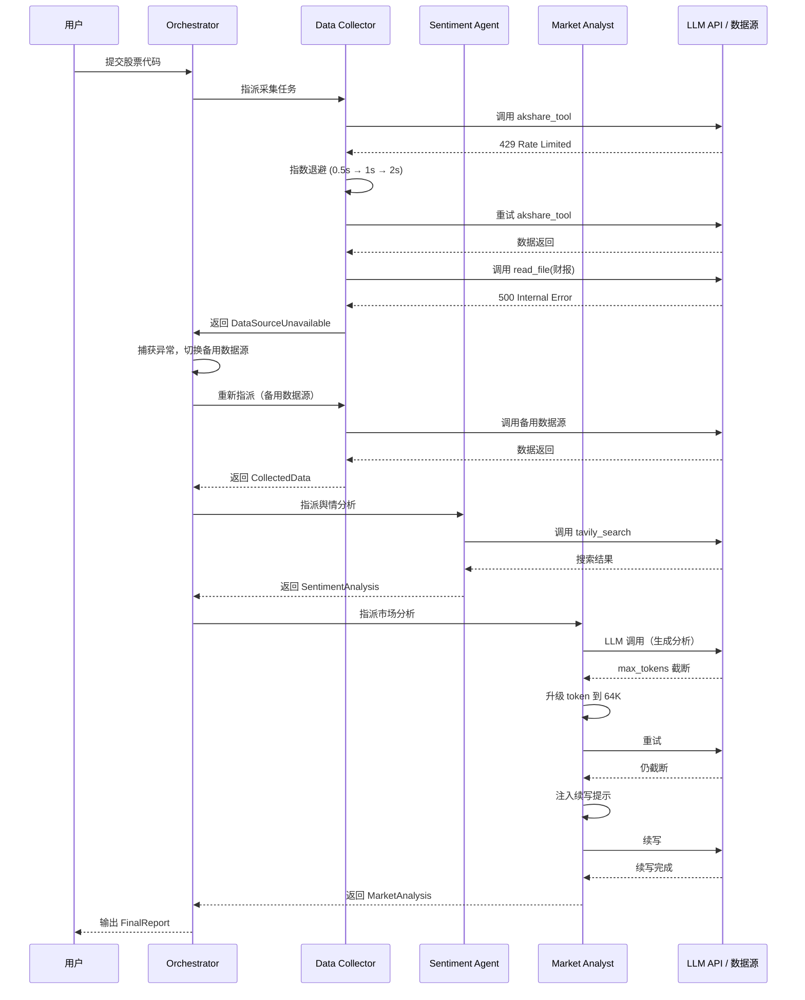

# Harness 迭代 9：错误恢复与韧性（v9）

## 10.1 可优化点

Agent 跑着跑着报错了：

```
Error: 529 overloaded
```

在金融研究场景中，错误的影响被放大：
- **Data Collector 在采集关键财报时 API 超时**：导致整个研究流程中断，已采集的数据可能丢失
- **Report Writer 在写入报告时网络中断**：已写入的部分报告损坏，需要从头再来
- **多 Agent 协作时的级联故障**：Data Collector 失败导致 Market Analyst 无数据可分析，整个系统崩溃
- **数据源不可用**：AKShare 服务维护、Tavily API 限流，导致数据采集失败
- **上下文超限**：采集了大量财报数据后，LLM 提示"上下文太长"

一个不处理错误的 Agent 就像一个一碰就熄火的车。在多 Agent 场景下，一个子 Agent 的失败会传导到整个系统。

## 10.2 Harness 策略

| 策略 | 说明 |
|------|------|
| **输出截断恢复** | `max_tokens` 用完时，升级到 64K 重试；仍不够则注入续写提示 |
| **上下文超限恢复** | `prompt_too_long` 时，触发 reactive compact 后重试 |
| **临时故障恢复** | 429/529 错误时，指数退避 + 抖动，连续 529 可切换备用模型 |
| **多 Agent 级联故障隔离** | 子 Agent 失败时，Orchestrator 捕获异常，尝试降级策略（如换数据源）而非整体崩溃 |
| **断点续传** | 已完成的子任务状态持久化，失败后可从断点恢复 |

## 10.3 迭代后的描述（v9）

**【金融研究多 Agent 系统 v9 — 错误恢复与韧性】**

**（在 v8 基础上新增/变更）**

**三种恢复模式**：

| 模式 | 触发 | 恢复动作 | 金融研究场景 |
|------|------|---------|------------|
| 输出截断 | `max_tokens` | 升级 8K→64K / 续写提示 | Report Writer 生成超长报告时截断 |
| 上下文超限 | `prompt_too_long` | reactive compact → 重试 | Data Collector 采集大量财报后上下文超限 |
| 临时故障 | 429 / 529 | 指数退避 + 抖动，连续 529 切换备用模型 | Tavily API 被限流 |

**多 Agent 级联故障隔离**：

```python
async def safe_delegate(agent, task, fallback_agent=None):
    try:
        return await agent.execute(task)
    except OverloadedError:
        # 指数退避重试
        return await retry_with_backoff(agent.execute, task)
    except DataSourceUnavailableError:
        # 降级：换备用数据源
        if fallback_agent:
            return await fallback_agent.execute(task)
        raise
    except AgentCrashError:
        # 隔离故障 Agent，标记为不可用
        mark_agent_unavailable(agent)
        # Orchestrator 尝试用其他方式完成
        return await orchestrator_fallback(task)
```

**断点续传机制**：

- 每个子任务完成后，将状态写入 `.checkpoints/{task_id}.json`
- 失败时读取 checkpoint，从断点恢复
- 金融研究场景：Data Collector 采集了 5 份财报后失败，恢复时只需重新采集剩余财报，已完成的 5 份保留

---

## 10.4 错误恢复在多 Agent 流程中的位置


