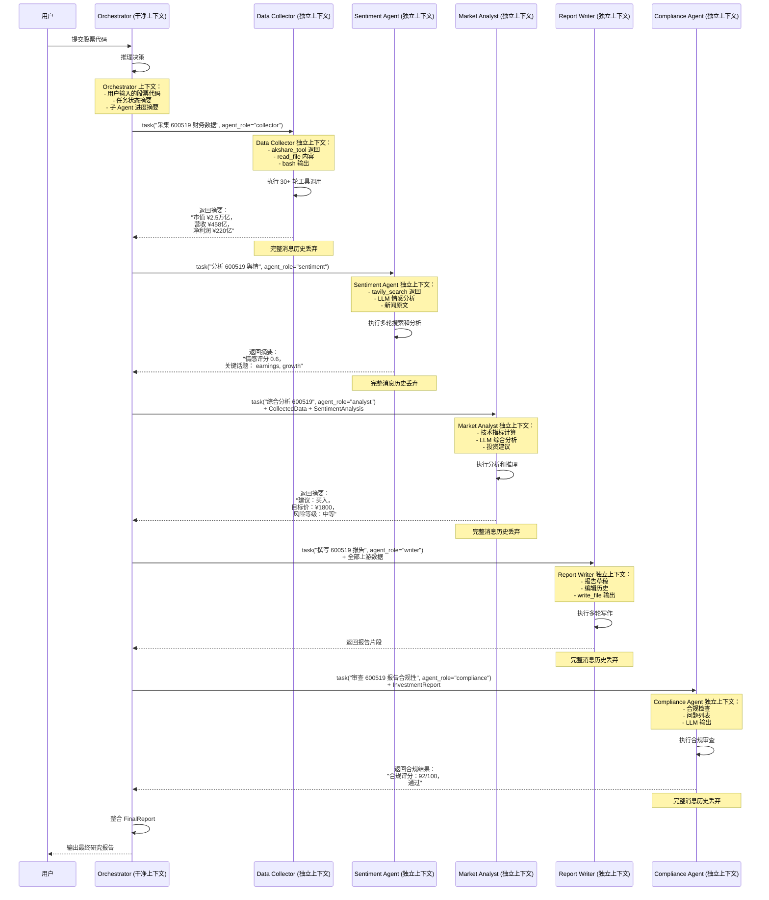

# Harness 迭代 10：子 Agent 与上下文隔离（v10）

## 11.1 可优化点

Agent 工作越久，messages 数组越臃肿。Data Collector 读了 20 份财报、执行了 50 次工具调用，每次读文件、跑命令的输出都永久留在上下文里。Report Writer 根本不需要这些详细的执行记录——它只需要采集结果的摘要。

在金融研究多 Agent 场景中，这个问题更加严重：
- **Data Collector 的详细上下文污染 Orchestrator**：Orchestrator 的上下文里塞满了财报原文、网页 HTML、Shell 输出，挤占了调度和决策的空间
- **Report Writer 被无关信息干扰**：写作 Agent 需要专注分析逻辑，但上下文里残留着数据采集的原始数据
- **不同研究主题之间的上下文串扰**：上次研究茅台的上下文残留，影响本次宁德时代的分析
- **子 Agent 的失败影响父 Agent**：Data Collector 执行了 30 轮后失败，Orchestrator 的上下文被污染且无法恢复

**子 Agent 应该用独立的 messages[] 启动，不污染父对话。**

## 11.2 Harness 策略

| 策略 | 说明 |
|------|------|
| **子 Agent 封装** | Orchestrator 有一个 `task` 工具，Subagent 拥有除 `task` 外的所有基础工具（禁止递归生成） |
| **独立上下文** | Subagent 以 `messages=[]` 启动，运行自己的循环。只有最终文本返回给 Orchestrator |
| **结果摘要** | Subagent 可能跑了 30+ 次工具调用，但整个消息历史直接丢弃。Orchestrator 收到的只是一段摘要文本 |

## 11.3 迭代后的描述（v10）

**【金融研究多 Agent 系统 v10 — 子 Agent 与上下文隔离】**

**（在 v9 基础上新增/变更）**

**子 Agent 封装**：

```python
PARENT_TOOLS = CHILD_TOOLS + [
    {"name": "task",
     "description": "Spawn a subagent with fresh context.",
     "input_schema": {
         "type": "object",
         "properties": {
             "prompt": {"type": "string"},
             "agent_role": {"type": "string", "enum": ["collector", "sentiment", "analyst", "writer", "compliance"]},
         },
         "required": ["prompt", "agent_role"],
     }},
]
```

**独立上下文**：

```python
def run_subagent(prompt: str, agent_role: str) -> str:
    # 每个子 Agent 独立的 System Prompt
    system = get_system_prompt(agent_role, context)
    sub_messages = [{"role": "user", "content": prompt}]


    for _ in range(30):  # safety limit
        response = client.messages.create(
            model=MODEL, system=system,
            messages=sub_messages,
            tools=CHILD_TOOLS, max_tokens=8000,
        )
        sub_messages.append({"role": "assistant",
                             "content": response.content})
        if response.stop_reason != "tool_use":
            break
        results = []
        for block in response.content:
            if block.type == "tool_use":
                handler = TOOL_HANDLERS.get(block.name)
                output = handler(**block.input)
                results.append({"type": "tool_result",
                    "tool_use_id": block.id,
                    "content": str(output)[:50000]})
        sub_messages.append({"role": "user", "content": results})


    # 只返回摘要文本，整个消息历史丢弃
    return "".join(
        b.text for b in response.content if hasattr(b, "text")
    ) or "(no summary)"
```

**金融研究场景的上下文隔离策略**：

| Agent | 上下文内容 | 隔离策略 |
|-------|-----------|---------|
| Orchestrator | 任务调度、子 Agent 结果摘要、全局状态 | 核心，保持精简 |
| Data Collector | 财报原文、AKShare 返回、Shell 输出 | 隔离为子 Agent，只返回摘要 |
| Sentiment Agent | 新闻原文、Tavily 返回、情感分析 | 隔离为子 Agent，只返回摘要 |
| Market Analyst | 技术指标、分析推理、LLM 输出 | 隔离为子 Agent，只返回摘要 |
| Report Writer | 报告草稿、编辑历史、write_file 输出 | 隔离为子 Agent，只返回摘要 |
| Compliance Agent | 合规检查、问题列表、LLM 输出 | 隔离为子 Agent，只返回摘要 |

**结果摘要格式**：

```
[Subagent: Data Collector]
任务：采集 600519 (茅台) 的财务数据
结果：
- 公司：贵州茅台酒股份有限公司
- 市值：¥2.5万亿
- PE：28.5
- PB：8.3
- 营收(2024Q1)：¥458亿 (同比+18%)
- 净利润(2024Q1)：¥220亿 (同比+15%)
- 数据来源：AKShare
- 数据完整性：已校验，无缺失
```

---

## 11.4 子 Agent 与上下文隔离架构


