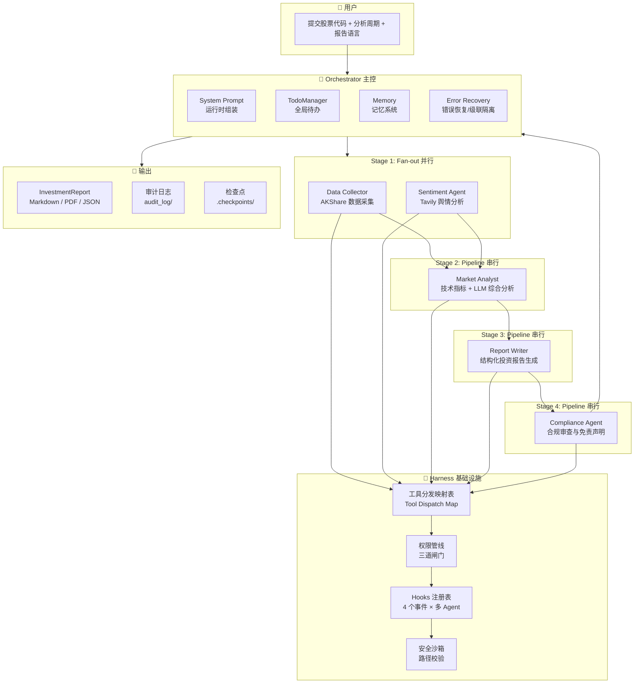

# 附录：完整 Harness 迭代全景图

---

## 12.1 附录 A：迭代路线总览

| 轮次 | 章节 | Harness 组件 | 对应参考资料 | 解决的金融研究场景问题 |
|------|------|-------------|-------------|---------------------|
| v0 | 第 1 章 | Agent Loop、基础工具、规划 | 01-v0 | 无 Harness，最朴素形态：5 个 Agent 的 Pipeline+Fan-out 编排 |
| v1 | 第 2 章 | 工具分发与安全沙箱 | 02-v1-tool-dispatch | Data Collector 的 AKShare 调用可能读写工作区外的文件；Sentiment Agent 的 Tavily 搜索参数可能被注入 |
| v2 | 第 3 章 | 权限管线 | 03-v2-permission | 金融数据敏感（财报、内幕信息），Agent 需要分级权限管控；Compliance Agent 需特殊权限 |
| v3 | 第 4 章 | Hooks 扩展机制 | 04-v3-hooks | 数据采集完成后自动触发数据校验、舆情分析完成后自动记录情感分数、报告撰写完成后自动触发合规审查 |
| v4 | 第 5 章 | 规划与待办管理 | 05-v4-todo | 5 个 Agent 协作时任务状态如何跨 Agent 同步；Data Collector 和 Sentiment Agent 并行后如何协调进入 Market Analyst |
| v5 | 第 6 章 | Skill 按需知识加载 | 06-v5-skill | 财报结构、行业术语、估值模型、A 股合规要求等知识按需注入，避免全量加载 |
| v6 | 第 7 章 | 上下文压缩 | 07-v6-compact | Data Collector 采集大量财报数据后上下文溢出；Report Writer 被无关原始数据淹没 |
| v7 | 第 8 章 | 记忆系统 | 08-v7-memory | 用户偏好（关注哪些指标、报告风格）、上次研究的行业背景跨会话保留 |
| v8 | 第 9 章 | System Prompt 运行时组装 | 09-v8-system-prompt | 5 个 Agent 需要不同的 System Prompt（Data Collector 强调"数据准确性"，Report Writer 强调"分析深度"） |
| v9 | 第 10 章 | 错误恢复与韧性 | 10-v9-error-recovery | AKShare API 超时、Tavily 限流、LLM 上下文超限、多 Agent 级联故障 |
| v10 | 第 11 章 | 子 Agent 与上下文隔离 | 11-v10-subagent | Data Collector 的详细执行上下文污染 Orchestrator；不同研究主题的上下文串扰 |

---

## 12.2 附录 B：全景架构图



**数据流说明**：

```
User → StockQuery(ticker, period, language)
  → Orchestrator 调度
    → [Fan-out] Data Collector  → CollectedData
    → [Fan-out] Sentiment Agent → SentimentAnalysis
    → [等待 Stage1 完成]
    → [Pipeline] Market Analyst(CollectedData, SentimentAnalysis) → MarketAnalysis
    → [Pipeline] Report Writer(CollectedData, SentimentAnalysis, MarketAnalysis) → InvestmentReport
    → [Pipeline] Compliance Agent(InvestmentReport, CollectedData) → ComplianceReport
    → FinalReport(report, compliance, data, sentiment, market)
  → 输出报告 (PDF + Markdown + JSON)
```

---

## 12.3 附录 C：vN 完整规格描述

> 汇总所有迭代后的最终完整设计描述。

---

**【金融研究多 Agent 系统 v10 — 完整规格描述】**

**身份**：你是一个多 Agent 金融研究报告自动生成系统的 Orchestrator，负责协调 5 个专业 Agent（Data Collector、Sentiment Agent、Market Analyst、Report Writer、Compliance Agent），根据用户输入的 A 股股票代码生成结构化投资研究报告。

**角色分工**：
- **Data Collector（数据采集 Agent）**：通过 AKShare 采集 A 股行情、财务指标、公司信息、公告摘要
- **Sentiment Agent（舆情分析 Agent）**：通过 Tavily API 搜索财经新闻，使用 LLM 分析情感倾向
- **Market Analyst（市场分析 Agent）**：计算 RSI/MA/波动率等技术指标，结合 LLM 进行综合分析
- **Report Writer（报告撰写 Agent）**：综合所有分析结果，生成包含 7 个章节的结构化投资报告
- **Compliance Agent（合规审查 Agent）**：审查报告合规性，确保符合 A 股监管要求

**编排模式**：Pipeline + Fan-out
- **Stage 1（Fan-out）**：Data Collector || Sentiment Agent 并行执行
- **Stage 2（Pipeline）**：Market Analyst 等待 Stage 1 完成后执行
- **Stage 3（Pipeline）**：Report Writer 等待 Market Analyst 完成后执行
- **Stage 4（Pipeline）**：Compliance Agent 等待 Report Writer 完成后执行

**数据模型**（Pydantic v2 强制 JSON Schema）：
- `StockQuery` → `CollectedData` + `SentimentAnalysis` → `MarketAnalysis` → `InvestmentReport` → `ComplianceReport` → `FinalReport`

**工具**（通过分发映射表注册）：
- `bash`：执行 shell 命令（路径沙箱校验）
- `read_file`：读取文件内容（路径沙箱校验）
- `write_file`：写入文件（路径沙箱校验）
- `edit_file`：编辑文件（路径沙箱校验）
- `akshare_tool`：AKShare 数据采集（Data Collector 专用）
- `web_search` / `news_search`：Tavily 搜索（Sentiment Agent 专用）
- `todo_write`：创建/更新待办事项列表（跨 Agent 同步）
- `load_skill`：按需加载 Skill 知识
- `compact`：手动触发上下文压缩

**权限管线**（三道闸门）：
1. **硬拒绝列表**：永远禁止的危险操作（`rm -rf /`、`sudo`、AKShare 敏感接口调用等）
2. **规则匹配**：上下文相关的操作（写工作区外、敏感数据外发、非授权行业数据查询等）
3. **用户审批**：规则命中后暂停等用户确认

**Hooks 机制**（四个事件 × 多 Agent）：
- `UserPromptSubmit`：注入行业背景信息、用户偏好
- `PreToolUse`：权限检查、敏感数据扫描、路径沙箱校验
- `PostToolUse`：数据校验、素材溯源、自动备份、触发下游 Agent
- `Stop`：输出研究统计、触发合规审查

**TodoManager**（跨 Agent 同步）：
- 待办项有 `pending`、`in_progress`、`completed` 三种状态
- 同一时间只允许一个 `in_progress`，强制顺序聚焦
- Orchestrator 维护全局待办列表，子 Agent 通过 Hook 同步进度
- 默认待办模板：数据采集 → 舆情分析 → 市场分析 → 报告撰写 → 合规审查 → 输出报告
- Nag Reminder：3 轮未更新时注入提醒

**Skill 按需加载**：
- 第一层（常驻）：System Prompt 中列出所有可用 Skill 名称和描述
- 第二层（按需）：Agent 调用 `load_skill` 加载完整内容
- 预置 Skill：`financial-statement-analysis`、`valuation-models`、`technical-analysis`、`industry-research`、`a-share-compliance`、`report-writing`、`macro-economics`

**上下文压缩**（三层策略）：
- **Layer 1: micro_compact**：每轮自动替换旧 tool result 为占位符
- **Layer 2: auto_compact**：token > 50000 时自动触发
- **Layer 3: manual_compact**：Agent 显式调用 `compact`

**记忆系统**：
- 四类记忆：`user`（用户偏好）、`feedback`（历史反馈）、`project`（项目上下文）、`reference`（参考材料）
- 索引常驻 SYSTEM，内容按需注入
- 每轮结束后自动提取新记忆
- 文件积累到一定数量后自动整理去重

**System Prompt 运行时组装**：
- PROMPT_SECTIONS 分段定义（identity、tools、workspace、agent_role、memory 等）
- 按 Agent 角色按需拼接（Data Collector 强调"数据准确性"，Report Writer 强调"分析深度"）
- 缓存避免重复组装

**错误恢复**（三种模式）：
- 输出截断：升级 8K→64K / 续写提示
- 上下文超限：reactive compact → 重试
- 临时故障：指数退避 + 抖动，连续 529 切换备用模型
- 多 Agent 级联故障隔离：子 Agent 失败时 Orchestrator 捕获异常，尝试降级策略而非整体崩溃
- 断点续传：已完成的子任务状态持久化，失败后可从断点恢复

**子 Agent 与上下文隔离**：
- 5 个 Agent 作为子 Agent 运行，独立 `messages[]`
- Data Collector 的详细执行记录不污染 Orchestrator 的调度上下文
- 只有结构化结果（Pydantic 模型）返回给 Orchestrator
- 不同研究主题之间上下文完全隔离

---

## 12.4 附录 D：Harness 四大核心问题的解决情况回顾

Kimi 的 JD 中点出了 Harness 需要解决的四个核心问题：

| 核心问题 | 通俗解释 | 解决迭代 | 具体策略 |
|---------|---------|---------|---------|
| **状态管理** | Agent 执行到哪一步了？已经做了什么？还差什么？ | v4 | TodoManager 跨 Agent 同步，全局待办列表，金融研究默认模板（数据采集→舆情分析→市场分析→报告撰写→合规审查） |
| **上下文交接** | 每一步执行完，下一步需要知道什么信息？信息怎么传递？ | v10 | 子 Agent 摘要返回，Pydantic 结构化数据模型传递，只有结构化结果进入 Orchestrator |
| **反馈闭环** | 工具调用成功了还是失败了？错误信息够不够清晰？怎么从错误中恢复？ | v9 | 三种恢复模式 + 级联故障隔离 + 断点续传；AKShare 超时换备用数据源，Tavily 限流指数退避 |
| **稳定、清醒与可控** | 跑了 50 步之后，Agent 还记不记得自己在干嘛？会不会跑偏？ | v6 + v7 | 上下文压缩 + 记忆系统，跨会话保留用户偏好和行业背景；Nag Reminder 防止注意力漂移 |

**防欠给**：
- 通过 `todo_write` 规划确保不遗漏关键步骤（数据采集→舆情分析→市场分析→报告撰写→合规审查）
- 通过 `Nag Reminder` 强制 Agent 回顾计划
- 通过 Hooks 机制自动触发数据校验（PostToolUse 校验 AKShare 返回数据的完整性）
- Pipeline 编排确保依赖顺序：Market Analyst 必须等待 Data Collector + Sentiment Agent 完成后才启动

**防错给**：
- 通过权限管线防止越权操作（硬拒绝 `rm`、规则匹配 AKShare 敏感接口）
- 通过敏感数据扫描防止信息泄露（PreToolUse 扫描 outgoing 数据）
- 通过数据校验 Hook 确保数据质量（PostToolUse 校验 AKShare 返回的财务数据字段完整性）
- 通过合规审查 Agent 确保报告符合监管要求

**防过给**：
- 通过上下文压缩控制 token 使用（micro_compact 每轮替换旧 tool result）
- 通过 Skill 按需加载避免无关知识干扰（分析白酒行业时不加载新能源行业知识）
- 通过 System Prompt 运行时组装避免信息过载（Data Collector 和 Report Writer 使用不同的 System Prompt）
- 通过子 Agent 上下文隔离防止详细执行记录污染 Orchestrator

**稳定性**：
- 通过错误恢复机制处理 API 异常（AKShare 超时、Tavily 限流、LLM 上下文超限）
- 通过级联故障隔离防止单点故障（Data Collector 失败时 Market Analyst 可降级运行）
- 通过断点续传保证任务可恢复（已完成的 Stage 1 数据持久化，失败后可从 Stage 2 恢复）
